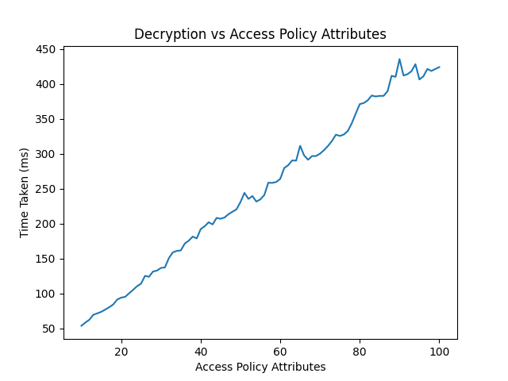
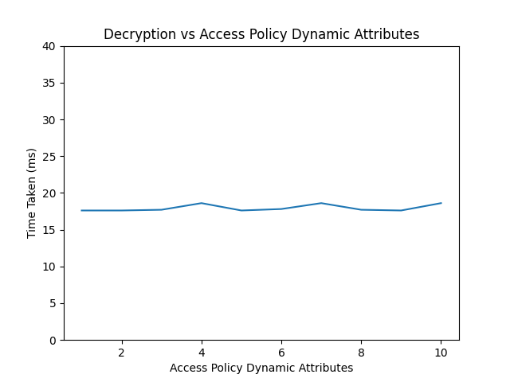
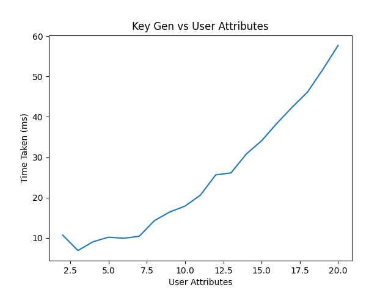
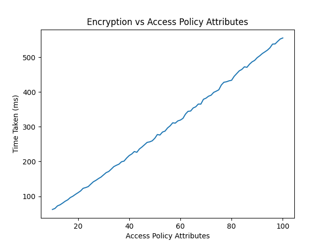
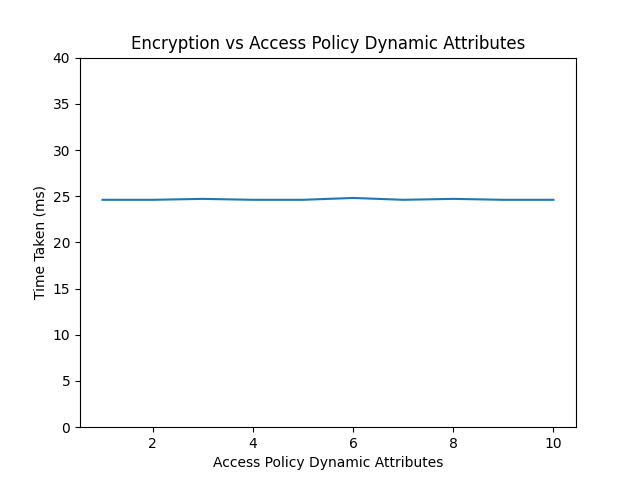

# Privacy-Preserving Multiauthority Attribute-Based Access Control Supporting Revocation

This project presents a scheme for privacy-preserving multi-authority attribute-based access control that supports user revocation. The scheme aims to provide secure and fine-grained access control over encrypted data stored on untrusted cloud servers. The key features of the proposed scheme are as follows:

## Features

- **Multi-Authority Setup**: The system involves multiple attribute authorities (AAs) responsible for managing different sets of attributes.
- **Attribute-Based Access Control**: Access to encrypted data is granted based on the user's attributes, which are defined by the data owner (DO) in the access policy.
- **User Revocation Support**: The scheme supports efficient user revocation by updating the ciphertext components associated with the revoked attributes.
- **Privacy Preservation**: The scheme preserves the privacy of user attributes by obfuscating the access policy and dynamic attributes during encryption and decryption processes.
- **Data Integrity**: The scheme ensures data integrity by incorporating a hash value of the ciphertext, which is verified during the decryption process.
- **Cloud Storage**: The encrypted data is stored on an untrusted cloud service provider (CSP), and the CSP performs a re-encryption process to enhance the security of the stored data.

## System Setup

The system setup involves the following steps:

1. The central authority (CA) initializes the system and registers all entities based on their requests.
2. The CA generates the public parameters (PP) for the system.
3. Each AA performs the authority setup algorithm to generate its master secret key (MSK) and public key (PK) for its attribute set.

## Key Generation

1. Each AA calculates the partial user secret key (Usk) for the data user (DU) and sends it to the DU.
2. The DU selects a random integer and calculates the final user secret key (Usk) for partial decryption at the data user agent (DUA).

## Encryption Process

1. The DO defines an access policy and encrypts the data using a symmetric key (ck).
2. The DO calculates the ciphertext components (C0, C1, C2) based on the access policy and dynamic attributes.
3. The DO calculates the hash of the ciphertext (CTH) for data integrity and sends the ciphertext (CTDO) to the CSP.

## Re-Encryption Process

The CSP performs a re-encryption process on the received ciphertext (CTDO) to enhance the security of the stored data.

## Decryption Process

The decryption process is divided into two phases:

1. **Partial Decryption at the DUA**:
  - The DUA obtains the ciphertext (CTDO) from the re-encrypted ciphertext (CTCSK) received from the CSP.
  - The DUA verifies the user's capability to access the data based on the access policy and dynamic attributes.
  - The DUA calculates intermediate decryption components (N1, N2) and sends them along with the ciphertext (CTDO) to the DU.

2. **Final Decryption at the DU**:
  - The DU calculates the symmetric key (ck) using the intermediate decryption components and the user secret key.
  - The DU verifies the data integrity by checking the hash value (CTH) and retrieves the original data.

## Security Features

1. **Decisional Diffie-Hellman (DDH) Assumption**: The security of the system is based on the DDH assumption, which ensures the confidentiality of the encrypted data.

2. **Collusion Resistance**: The scheme is designed to prevent collusion attacks, where multiple users attempt to combine their attributes to gain unauthorized access to the data.

3. **Key Escrow Elimination**: The scheme eliminates the risk of key escrow by distributing the generation of user secret keys across multiple attribute authorities and the cloud service provider.

4. **Man-in-the-Middle and Forgery Attack Prevention**: The scheme incorporates a hash computation to ensure the integrity of the ciphertext, preventing man-in-the-middle and forgery attacks.

5. **User/Attribute Revocation**: The scheme supports efficient user and attribute revocation by updating the ciphertext components associated with the revoked attributes.

6. **Access Policy Obfuscation**: The scheme introduces a trusted entity, the Data Owner Assistant (DOA), to obfuscate and protect the privacy of the access policy. The access policy is encrypted using a shared key between the Data Owner (DO) and the DOA, ensuring confidentiality.

7. **Dynamic Attributes**: The scheme supports dynamic attributes, such as location or time, which must be satisfied by the Data User (DU) to access the data. These attributes are securely incorporated using a secret sharing scheme, ensuring confidentiality and flexible access control.

8. **Resistance to Collusion Attacks**: The scheme is designed to prevent collusion attacks, where multiple users attempt to combine their attributes to gain unauthorized access to the data.

9. **Elimination of Key Escrow**: The scheme eliminates the risk of key escrow by distributing the generation of user secret keys across multiple attribute authorities and the cloud service provider.

10. **Safeguards Against Man-in-the-Middle and Forgery Attacks**: The scheme incorporates a hash computation to ensure the integrity of the ciphertext, preventing man-in-the-middle and forgery attacks.

11. **User/Attribute Revocation Support**: The scheme supports efficient user and attribute revocation by updating the ciphertext components associated with the revoked attributes.

## Usage

To use this project, follow these steps:

1. Set up the system by running the system setup algorithm and registering all entities.
2. Generate keys for the AAs and DUs using the key generation algorithms.
3. Encrypt data using the encryption algorithm, providing the access policy and dynamic attributes.
4. Store the encrypted data on the CSP, which will perform the re-encryption process.
5. Decrypt the data at the DUA and DU using the partial and final decryption algorithms, respectively.

## Experimental Result

## Contributors

Chinmay

Ritik

Sahaj